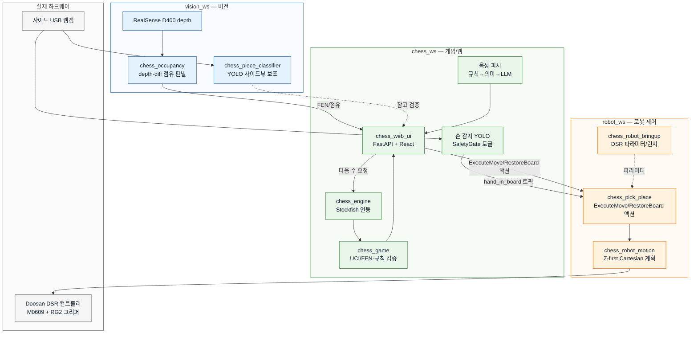
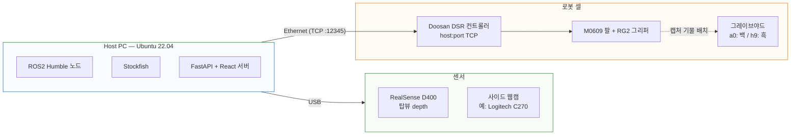
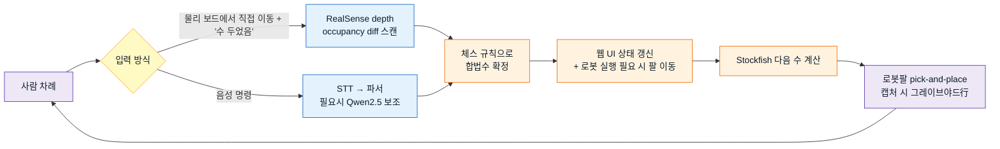

# Rokey-A-1-cobot2 — ChessMate

**Doosan 협동로봇(M0609)**이 사람과 **실물 체스판**에서 직접 대국하는 ROS2 Humble 모노레포입니다.
RealSense depth 인식 + 사이드 웹캠 YOLO 이중 비전으로 사람의 수를 감지하고, Stockfish가 다음 수를 계산하면
로봇팔이 실제로 기물을 집어 옮깁니다. 음성 명령, 웹 UI(React), 손 안전 감지, 캡처 기물 관리(그레이브야드),
보드 자동 정리/되돌리기까지 포함된 엔드투엔드 시스템입니다.

## 주요 기능

- **실물 체스 대결** — 사람 vs 로봇, 웹 UI에서 색 선택 후 물리 보드 위에서 진행
- **이중 비전 인식**
  - RealSense depth 기반 보드 점유 판별 (빈 보드 기준 depth와의 차이로 기물 유무 판단, 딥러닝 불필요)
  - 사이드 웹캠 YOLO — 손 감지(안전 정지), 기물 인식(Reality Check 참고 검증)
- **음성 명령** — 수 두기("e2 폰을 e4로"), 되돌리기, 보드 정리, 기권을 음성으로 지시하면 로봇팔이 대신 수행
  (브라우저 STT → 규칙/의미 기반 파서 → 애매한 경우만 Ollama/Qwen2.5 LLM 보조)
- **협동로봇 안전** — 실시간 손 감지 시 로봇 모션 자동 정지(SafetyGate), 오탐이 잦을 때 끌 수 있는 웹 토글
- **캡처 기물 관리** — 잡힌 기물을 물리적으로 그레이브야드(포로 보관대)에 이동, 대국 종료 후 보드 자동 복원(restore)
- **오류 복구** — 이동 중 오류가 나도 이전 수 되돌리기(undo)·보드 재정렬로 재시작 없이 복구
- **난이도 조절** — Stockfish Elo/Skill Level 프리셋으로 실력별 대응
- **웹 UI(React)** — 실시간 기보, 형세 평가 그래프, 캡처 기물 바, 사이드뷰/손 감지 미리보기

## 시스템 설계

### 아키텍처



### 하드웨어 구성



### 한 수(턴) 진행 흐름



### 인터페이스 구조

UI부터 하드웨어까지 REST API · ROS2 Topic/Service/Action 네 종류로 연결됩니다 (`web_bridge.py`, `vision_game_node.py`, `doosan_pick_place_node.py` 기준).

| 종류 | 예시 | 용도 |
|---|---|---|
| REST API | `POST /api/move`, `POST /api/voice-move`, `GET /api/board`, `POST /api/games/save` | React 웹 UI ↔ FastAPI 백엔드 |
| ROS2 Topic | `chess/board_state`, `chess/hand_in_board`, `vision/live_occupancy`, `chess/game_snapshot` | 비전 인식·손 감지 결과 스트리밍 |
| ROS2 Service | `chess/confirm_player_move`, `chess/scan_initial`, `chess/apply_robot_move`, `robot/user_stop` | 동기 요청/응답 (수 확정, 초기 스캔, 긴급 정지) |
| ROS2 Action | `robot/execute_move`, `robot/restore_board` | 장시간 로봇 pick-and-place 작업 (진행률 피드백 포함) |

### 데이터 저장

`chess_web_ui`는 SQLite(`game_store.py`) 단일 `games` 테이블에 대국 상태를 저장해 재시작 후에도 이어서 진행할 수 있습니다.

| 구분 | 컬럼 예시 |
|---|---|
| 메타 | `id`, `created_at`, `updated_at`, `is_active` |
| 게임 상태 | `fen`, `human_color`, `difficulty`, `game_phase`, `eval_cp`, `bot_status` |
| 기물 데이터 | `graveyard_slots_json`, `human_captures_json`, `robot_captures_json` |
| 기보 | `move_history_json`, `ply_counter`, `last_bot_move` |

## 운영체제 / 실행 환경

| 항목 | 버전 |
|---|---|
| OS | Ubuntu 22.04 LTS (Jammy) |
| ROS2 | Humble |
| Python | 3.10 |
| Node.js | 20 (nvm 관리, apt 기본 v12는 사용 불가) |
| npm | 10 |
| 빌드 시스템 | colcon (`--symlink-install`) |

## 사용한 장비 목록

| 장비 | 용도 |
|---|---|
| Doosan Robotics **M0609** 협동로봇 | 기물 pick-and-place |
| Doosan **RG2** 그리퍼 | 기물 파지 |
| Intel **RealSense** D400 시리즈 (Depth) | 탑뷰 보드 점유 인식 (depth-diff) |
| USB 웹캠 (예: Logitech C270) | 사이드뷰 — 손 감지, 기물 참고 인식, 음성 명령용 마이크 |
| 실물 체스 세트 + 보드 | 대국 대상 |
| PC (Ubuntu 22.04, GPU 권장) | ROS2 노드 + YOLO 추론 + 웹 서버 구동 |

## 의존성

### ROS2 (apt/rosdep)
`rclpy`, `cv_bridge`, `std_msgs`/`std_srvs`/`geometry_msgs`/`sensor_msgs`, `realsense2_camera`,
`dsr_msgs2`/`DR_init`(Doosan `doosan-robot2`, Git 미포함 — 아래 설치 참고)

### Python (pip)
`requirements.txt` 참고:

```text
chess>=1.11
fastapi>=0.110
uvicorn[standard]>=0.29
pydantic>=2.6
numpy>=1.26,<2
opencv-python>=4.9
ultralytics>=8.2
huggingface_hub>=0.22
torch>=2.2
PyYAML>=5.4
```

```bash
pip install -r requirements.txt
```

### 음성 명령 LLM 보조 (선택)
[Ollama](https://ollama.com) + `qwen2.5:7b` — 규칙/의미 기반 파서로 해석이 애매할 때만 호출됩니다.
```bash
ollama pull qwen2.5:7b
```

### 프론트엔드 (Node)
`chess_ws/src/chess_web_ui/frontend/package.json` — React + TypeScript + Vite (`npm install`)

## 저장소 구조

```
Rokey-A-1-cobot2/
├── chess_interface_ws/src/chess_msgs/       # 공통 ROS2 메시지/서비스/액션
├── vision_ws/src/                           # 보드 검출, depth 점유, 기물 분류
├── chess_ws/src/                            # 게임 로직, Stockfish 엔진, 웹 UI
├── robot_ws/src/                            # pick-place, 로봇 모션, DSR bringup
├── scripts/                                 # 빌드·외부 의존성 스크립트
├── requirements.txt                         # Python(pip) 의존성
└── chess_project_env.sh                     # 통합 환경 source
```

| 워크스페이스 | 패키지 |
|---|---|
| chess_interface_ws | chess_msgs |
| vision_ws | chess_board_detector, chess_occupancy, chess_piece_classifier, chess_vision_bringup |
| chess_ws | chess_game, chess_engine, chess_web_ui, chess_coach, chess_dialogue, chess_orchestrator, chess_ui |
| robot_ws | chess_pick_place, chess_robot_bringup, chess_robot_motion |

## 설치

```bash
git clone https://github.com/yngkim/Rokey-A-1-cobot2.git ~/Rokey-A-1-cobot2
cd ~/Rokey-A-1-cobot2

# doosan-robot2 (Git 미포함, ~450MB, 별도 설치)
bash scripts/setup_doosan.sh
cd ~/cobot_ws && colcon build --symlink-install

# Python 의존성
pip install -r ~/Rokey-A-1-cobot2/requirements.txt

# 모노레포 ROS2 패키지 빌드
cd ~/Rokey-A-1-cobot2
bash scripts/build_all.sh

# 프론트엔드
cd chess_ws/src/chess_web_ui/frontend && npm install
```

## 환경 활성화

```bash
source ~/Rokey-A-1-cobot2/chess_project_env.sh
```

기존에 `~/chess_ws` 등 분리 워크스페이스를 쓰고 있었다면 `CHESS_REPO_ROOT` 환경 변수로 이 저장소 경로를 지정하세요.

```bash
export CHESS_REPO_ROOT=~/Rokey-A-1-cobot2
source ~/Rokey-A-1-cobot2/chess_project_env.sh
```

## 실행 순서 (터미널 3개)

```bash
# 터미널 1 — Doosan DSR bringup (실기 로봇)
source ~/Rokey-A-1-cobot2/chess_project_env.sh
ros2 launch chess_robot_bringup cobot_dsr_bringup.launch.py host:=192.168.137.100
# 필요 시 실기 제어 모드 전환: ros2 service call /dsr01/system/set_robot_mode ...

# 터미널 2 — 비전 + 로봇 pick-place + web_bridge (FastAPI)
source ~/Rokey-A-1-cobot2/chess_project_env.sh
ros2 launch chess_web_ui vision_manual.launch.py use_fake:=false \
  twin_enabled:=true twin_webcam_device:=0 hand_enabled:=true

# 터미널 3 — React 웹 UI
cd ~/Rokey-A-1-cobot2/chess_ws/src/chess_web_ui/frontend && npm run dev
```

브라우저에서 `http://localhost:5173` (Vite dev 기본 포트) 접속 후, 색 선택 → **Reset**(로봇 홈 + 초기 스캔) → 대국 시작.

### 주요 launch 인자 (`vision_manual.launch.py`)

| 인자 | 기본값 | 설명 |
|---|---|---|
| `use_fake` | `false` | `true`면 카메라/로봇을 stub으로 대체 (하드웨어 없이 테스트) |
| `human_color` | `white` | 사람 진영 색 |
| `auto_bot_move` | `true` | 로봇 자동 응수 여부 |
| `difficulty` | `medium` | Stockfish 난이도 프리셋 |
| `engine_depth` | `8` | Stockfish 탐색 깊이 |
| `twin_enabled` / `twin_webcam_device` | `false` / `10` | 사이드뷰 보드 검증(Reality Check) 및 웹캠 장치 번호 |
| `hand_enabled` | `true` | 손 감지 안전 정지 사용 여부 |
| `voice_llm_enabled` / `voice_llm_auto` | `false` / `true` | 음성명령 LLM(Qwen) 강제 사용 / 애매할 때만 자동 사용 |

### Fake 모드 (하드웨어 없이 로직만 테스트)

```bash
ros2 launch chess_web_ui vision_manual.launch.py use_fake:=true
```

## Git에 포함하지 않는 항목

- `build/`, `install/`, `log/` (colcon 산출물)
- `frontend/node_modules/`
- `doosan-robot2` (외부 vendor — `scripts/setup_doosan.sh`로 설치)

## 참고

자세한 웹 UI·게임 흐름은 `chess_ws/src/chess_web_ui/README.md`를 참고하세요.
